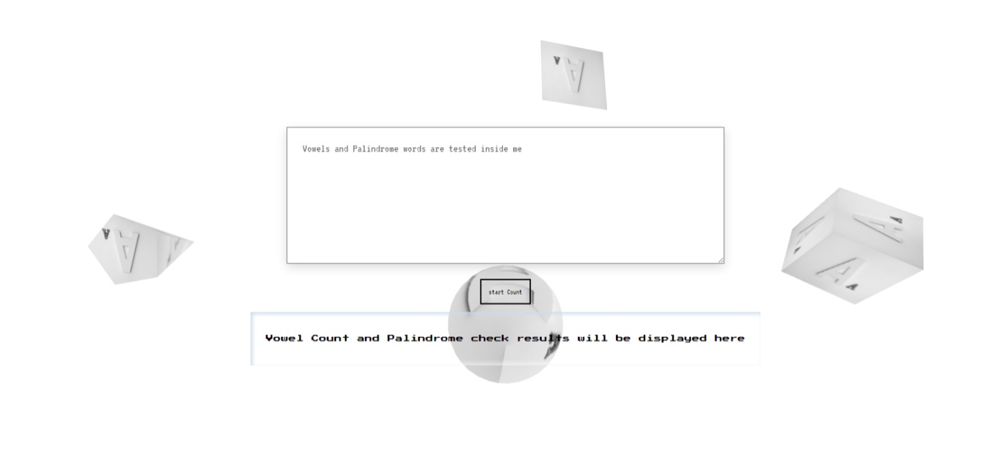

# VowelCounter-PalendromeChecker
# Name: **Makhosetive Sibanda**

-----------------------------------------------------------------------------------------------------------------------------------------------------------------------
# Project Description 

This project is a combination of a Vowel Counter and Palindrome Checker WebApp. Its purpose is to provide a platform for practicing vanilla JavaScript, with a focus on one of the popular interview questions. The user is prompted to enter a word, and upon pressing enter, the WebApp displays whether the word is a palindrome and the number of vowels in the word. Additionally, the WebApp incorporates my first practice code using Three.js, creating an engaging visual experience with animated objects like cubes, cones, spheres, and planes as the background
-------------------------------------------------------------------------------------------------------------------------------------------------------------------------
## Usage

1. Enter a word in the input field.
2. Press enter or click the submit button.
3. The app will display whether the word is a palindrome and the number of vowels in the word.
-----------------------------------------------------------------------------------------------------------------------------------------------------------------------------
## Code Structure

The code is organized into the following files and directories:

- `index.html`: The main HTML file.
- `style.css`: The CSS file for styling the web app.
- `script.js`: The JavaScript file containing the logic for vowel counting and palindrome checking.
- `three.js`: The Three.js library for creating the animated background.
-----------------------------------------------------------------------------------------------------------------------------------------------------------------------
## Contact

For questions or feedback, you can reach me at [sibandamakhosetive7@gmail.com](mailto:sibandamakhosetive7@gmail.com).
